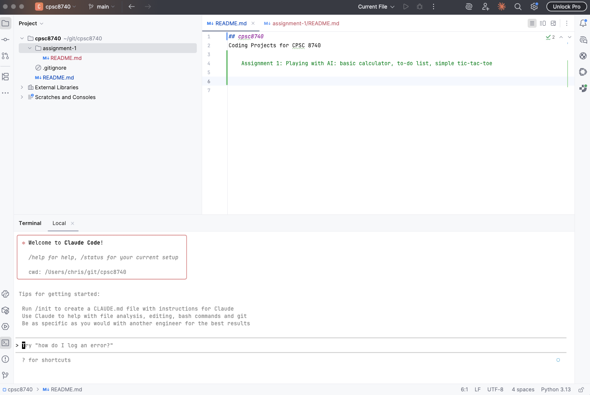
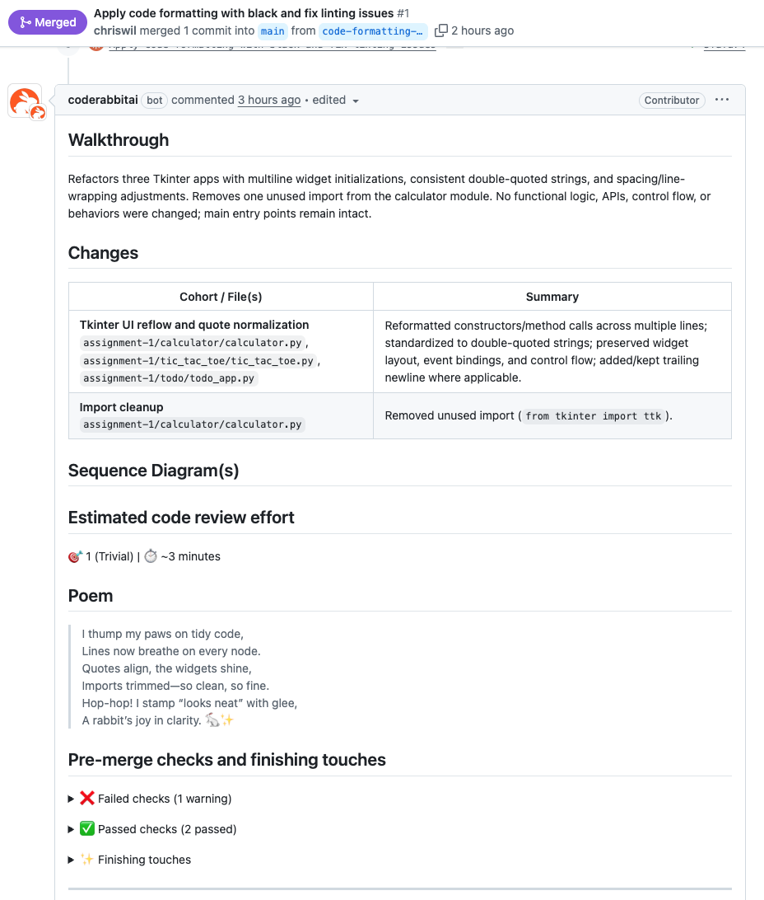

# CPSC 8740 Assignment 1
### Chris Williams, Clemson ID: C11798406, cwill47@clemson.edu

Code available at [chriswil/cpsc8740: Coding Projects for CPSC 8740](https://github.com/chriswil/cpsc8740)

## Setup and Introduction
   
### AI Tools 

I chose to use:
* PyCharm IDE + Claude Code running in Terminal
* Claude Chatbot
* Code Rabbit

### Intro to Tools

#### PyCharm + Claude Code + Claude Chat

I primarily code in Python these days, so I chose the PyCharm IDE which I'm comfortable working with for editing and debugging Python code. I am using Claude Code for code generation and assistance with the 3 apps that we're working on.

For brainstorming possible ideas and thinking ideas of what I'd like to implement with Claude Code, 
I'm using the Claude desktop app for general queries, as well as looking up frameworks and APIs that
Claude Code suggests during implementation.

As you can see in this screenshot, I use the Claude Code command line tool within a Terminal window in PyCharm. I can have a conversation with Claude Code and I can give it access to all of the files in the project so that it can modify files within the project as we're talking through what I want to build. While it is a command line tool, the fact that I can chat with it via the command line and see the code changes in the IDE in real time, it actually has the feel of pair programming. If I need to make slight changes to anything it generates, I can ask Claude to review the code changes and continue working. No need to copy and paste from the Claude Chatbot.

Claude Code and submit pull requests to GitHub, which I can review from Code Rabbit's web interface.

#### Code Rabbit (coderabbit.ai)

I wanted to experiment with automated AI-powered review of the code that Claude Code is generating so I am using Code Rabbit to review pull requests from Claude Code. Claude Code integrates nicely with Github using the GitHub command line program, gh. When I generate a large code change using Claude Code, I can then have it create a pull request on GitHub. Code Rabbit is set up to look at all incoming pull requests and will automatically review the code, generating comments on the pull request that I can use as a guide for my own review of the code being generated. 

Code Rabbit currently uses OpenAI's GPT-3.5 and GPT-4, Anthropic's Claude, and Google's Gemini. S

## Experimentation

Our task was to create three apps: a basic calculator, a to-do list application, and a simple tic-tac-toe. I started the process by discussing some ideas with Claude Desktop about what I wanted to build. I wanted something that was easy to package up and run, so web applications were not an option. We discussed several UI alternatives: tkinter, kivy, PyQt, etc. We went through the pros and cons of each option. I decided to go with tkinter due to the ease of use, and the fact that it's included with standard Python. Anyone should be able take my scripts and run them successfully, as long as they're working with relative recent release of Python. 

Once Claude Chatbot and I came up with a plan, I started a session with Claude Code in PyCharm. I captured notes from the chatbot conversation and copy and pasted relevant portions of that discussion into Claude Code. A best practice for using Claude Code is to have a CLAUDE.md file. This is a special file included in the project that can provide context and instructions for Claude to follow during our conversations about the code that is being generated.

I discussed how I wanted to:
* keep all code easily portable
* how to structure the files that are generated within my git repo
* have Claude Code manage interactions with the git repo: commits, pull requests, etc.
* integrate with CodeRabbit.ai for automated code reviews

After that conversation was completed, I instructed Claude Code to write the CLAUDE.md file for me and I edited with a few small changes. It did a very good job of capturing our conversation and summarizing my requirements.

## Analysis and Reflection

